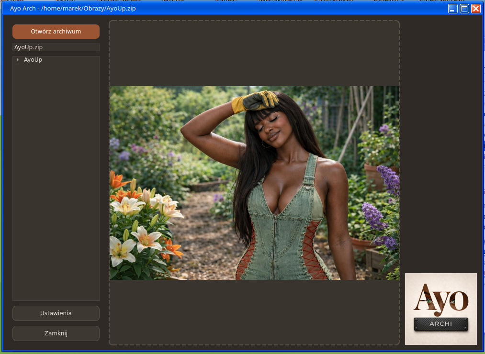
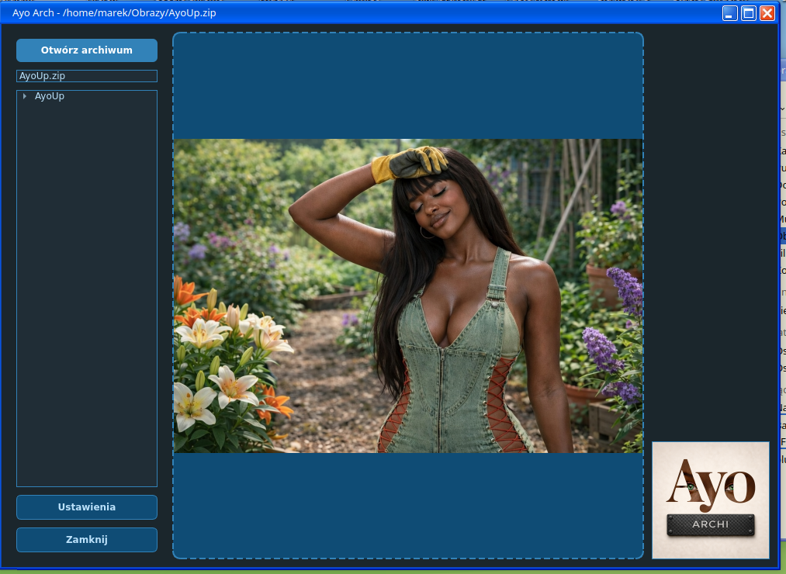
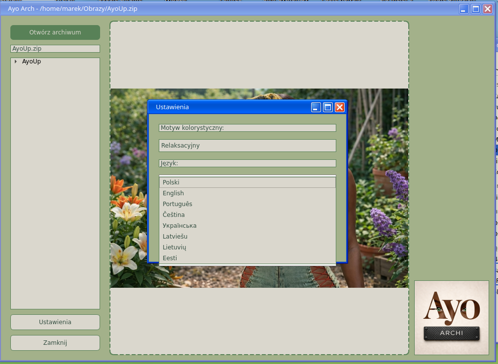
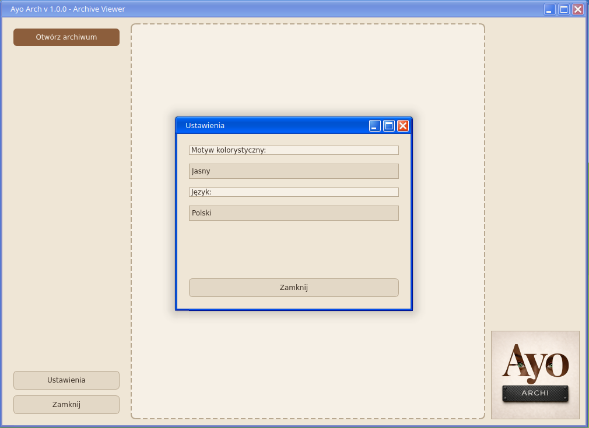

# AyoARCH 1.0.1 – Intelligent ZIP Image Viewer 📦🖼️


**AyoARCH** is a fast and lightweight image viewer designed to browse images directly inside ZIP archives — without extracting files to disk.
Built for creators, writers, and collectors who value speed, order, and disk efficiency.

---

## 📸 Program Preview

|                            Dark Theme                           |                                Creative Theme                               |                             Relax Theme                            |                              Settings                             |
| :-------------------------------------------------------------: | :-------------------------------------------------------------------------: | :----------------------------------------------------------------: | :---------------------------------------------------------------: |
| [](screenshots/main_dark.png) | [](screenshots/main_creative.png) | [](screenshots/main_relax.png) | [](screenshots/settings.png) |

---

## 🆕 What’s New in 1.0.1

* 🎨 **New Creative Theme** added to the Ayo visual style family
* ⚙️ **Code optimizations and internal improvements** for better performance and stability
* 🧠 Improved responsiveness when browsing large archives

---

## 🚀 Key Features

### ⚡ Zero-Temp Strategy

Images are loaded directly into RAM.
The application **never creates temporary files**, keeping your system clean and your SSD safe.

### 📦 Instant ZIP Access

Browse images directly inside standard ZIP archives with no extraction and no waiting.

### 🎨 Ayo Interface

Consistent UI design shared across the Ayo ecosystem:

* Dark Theme
* Relax Theme
* **Creative Theme (new in 1.0.1)**

### 🪟 Professional Settings Workflow

Modal settings window ensures a clean and distraction-free workflow.

### 💨 Lightweight & Fast

Minimal dependencies and optimized loading for instant image browsing.

---

## 🖼️ Supported Image Formats

**Standard**

* PNG
* JPG / JPEG
* BMP
* GIF

**Professional & Modern**

* TIFF / TIF
* WEBP

**System Icons**

* ICO

---

## 🌍 Supported Languages

* 🇵🇱 Polish
* 🇺🇸 English
* 🇵🇹 Portuguese
* 🇨🇿 Czech
* 🇺🇦 Ukrainian
* 🇱🇻 Latvian
* 🇱🇹 Lithuanian
* 🇪🇪 Estonian

---

## 🎨 Visual Identity (Ayo Style)

| Element      | Color     |
| ------------ | --------- |
| Background   | `#2e2e2e` |
| Accent Gold  | `#e1ad01` |
| Primary Text | `#ffffff` |

---

## 🛠️ Technology

Developed on Linux using a modern Python + Qt stack:

* **Language:** Python 3
* **GUI:** PySide6 (Qt for Python)
* **Archive Engine:** zipfile (Python standard library)
* **Development Environment:** OpenSUSE + KDE Plasma

---

## 🌌 Ayo Ecosystem

* **Ayo-UP** – file uploading and update management
* **AyoCONVERT** – high-quality file conversion
* **AyoSORT** – intelligent image categorization

More projects:
👉 https://klucznik26.github.io/AyoWWW/

---

## 📖 About the Project

AyoARCH was created as part of a creative toolkit supporting visual research and world-building.
The application was designed to quickly browse large collections of reference images stored in archives — without cluttering disk space.

---

## 📥 Installation

```bash
git clone https://github.com/Klucznik26/AyoARCH.git
cd AyoARCH
python main.py
```
