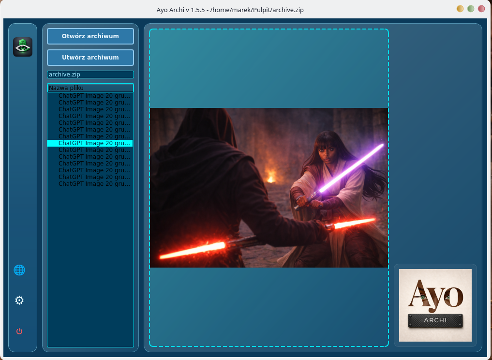
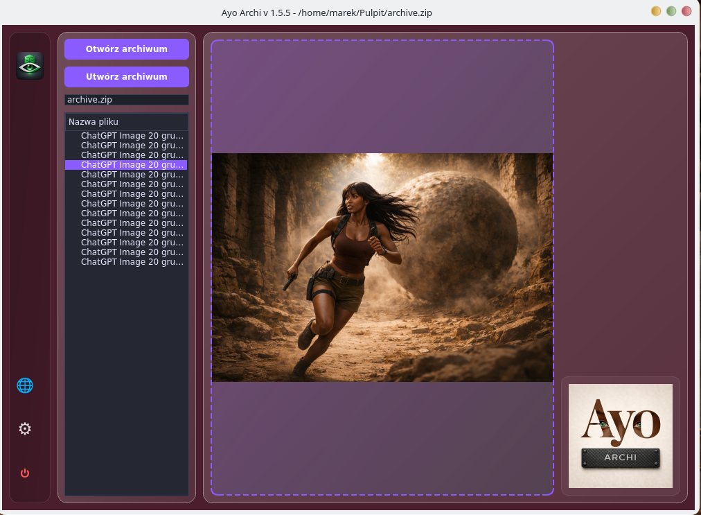
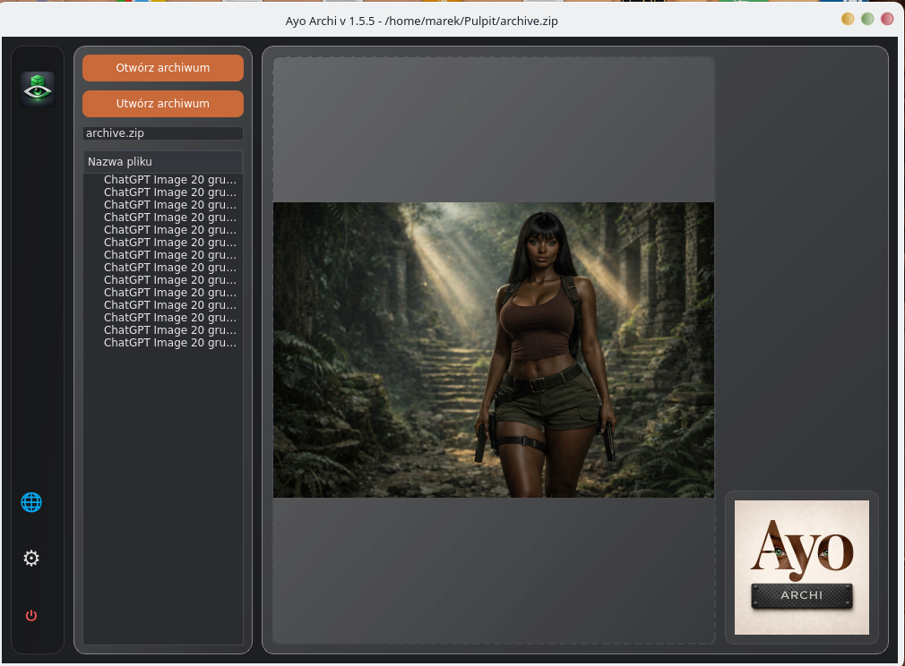
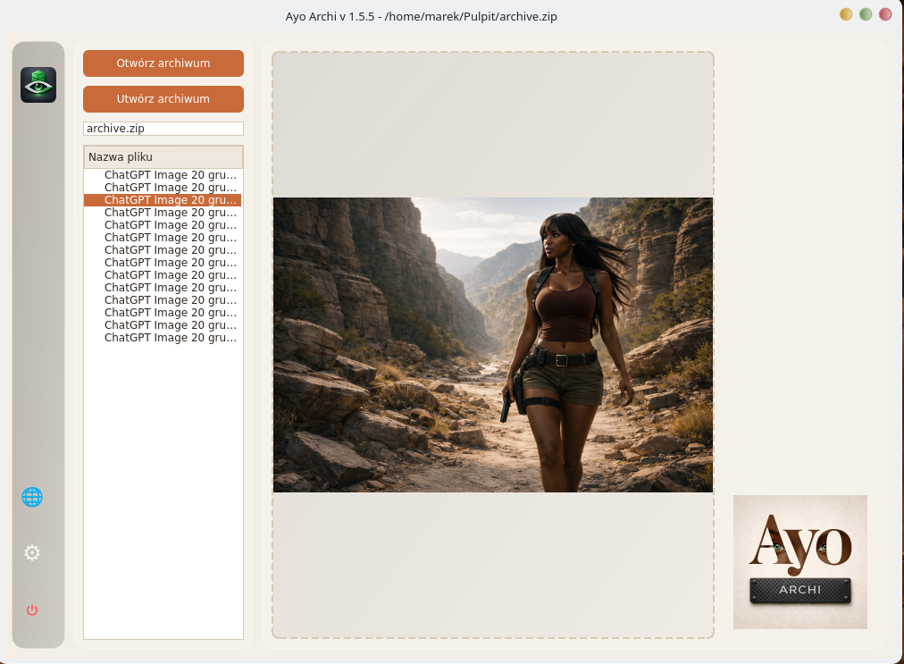
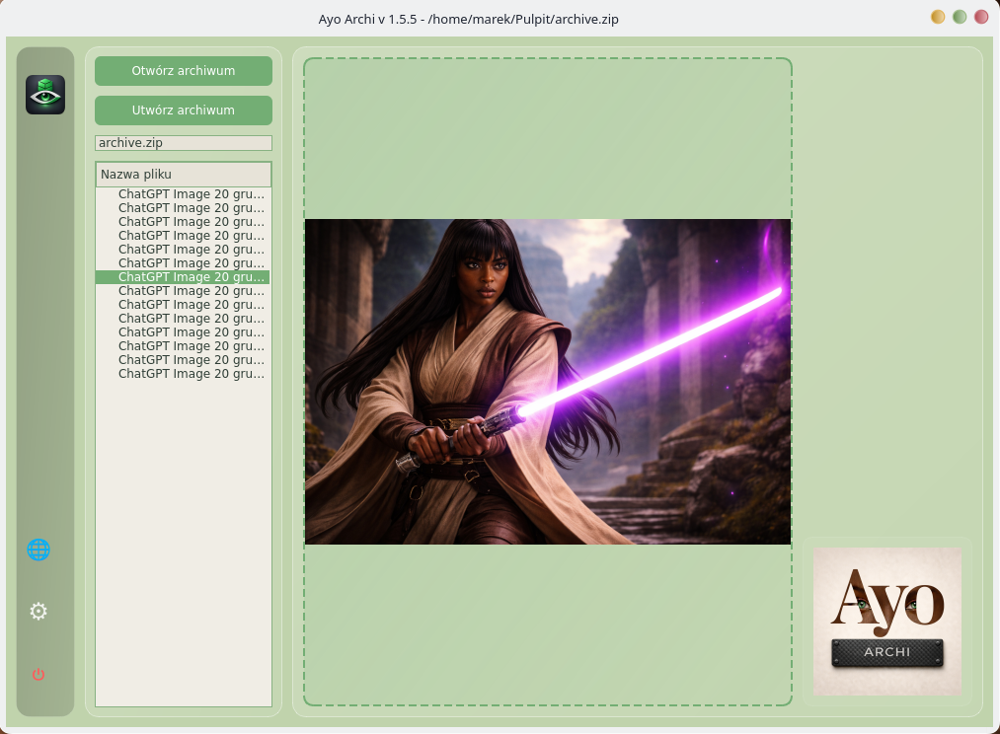
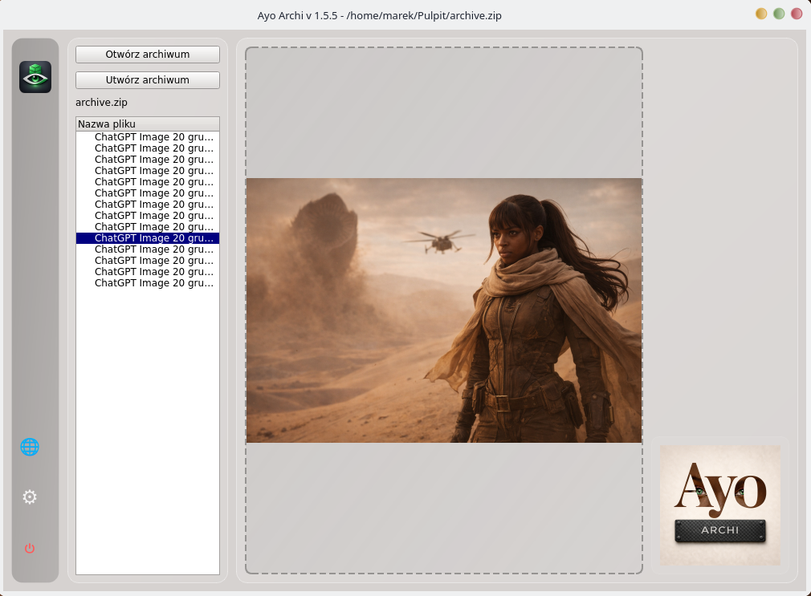
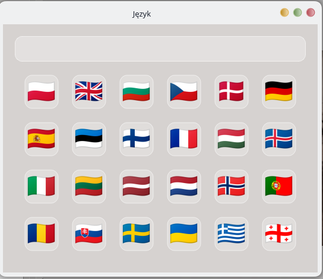
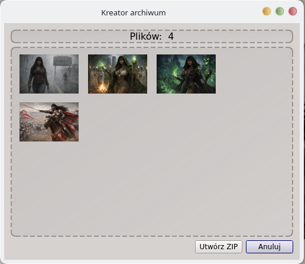
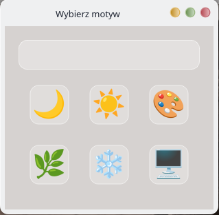

# AyoARCHI 1.5.5 – Intelligent Archive Image Viewer 📦🖼️

AyoARCHI is a fast and lightweight desktop application designed to browse images directly inside archive files — without extracting them to disk.

Built for creators, researchers, writers, and collectors who work with large visual libraries and want fast, clean, and organized access to images.

Part of the Ayo Ecosystem.

## 📸 Screenshots

### Main Interface Themes

| Arctic | Creative | Dark | Light | Relax |
|---|---|---|---|---|
| [](screenshots/main_arctic_theme.png) | [](screenshots/main_creative_theme.png) | [](screenshots/main_dark_theme.png) | [](screenshots/main_light_theme.png) | [](screenshots/main_relax_theme.png) |

### Functional Views

| Archive Browser | Language Selection |
|---|---|
| [](screenshots/archive_browser.png) | [](screenshots/language_selection_window.png) |
| [](screenshots/settings_window.png) | [](screenshots/theme_selection_window.png) |

## 🆕 What’s New in 1.5.5

## ✅ Full Implemented Changes (Up to 1.5.5)

- project branding updated from `Ayo Arch` to `Ayo Archi` across UI and translations
- application version unified to `1.5.5` (window title, info dialog, translation titles, setup script, docs)
- complete i18n migration to JSON files in `i18n/` (`*.json`, one file per language)
- language switching fixed for UI labels, buttons, dialog text, and menu captions
- added and validated language support: Dutch, Danish, Swedish, Norwegian, Finnish, Icelandic, Hungarian, Romanian, Bulgarian
- removed Russian language from the active release
- language chooser improved:
- flag next to each language
- improved ordering (Polish first, English second, then alphabetical)
- hover label shows native language name + current UI language name
- denser flag grid, stronger contrast, glass-style hover label
- flag hover enlargement behavior refined
- file dialog captions translated (`Look in`, `File name`, `Open`, `Cancel`, etc.)
- create archive dialog improvements:
- translated title/buttons (`Create ZIP`, `Create archive`)
- `Create ZIP` disabled until files are added
- drop area supports thumbnail-only presentation (without file names)
- create archive destination handling fixed (archive now saved in selected location)
- theme names translated in the theme selection menu
- added new **Arctic** theme and iterative visual tuning:
- icy sidebar gradient for icon panel
- less aggressive blue action buttons
- lighter navy main background (instead of near-black)
- creative theme background changed to burgundy
- relax theme green accents made slightly more vivid
- icon sizing and color consistency updates for narrow side panel controls
- info/about dialog reworked:
- full translation support in all languages
- glass-like rounded text panels
- better contrast on dark themes
- improved logo/title/version placement
- UI refactor: large `ui.py` split into modular files (`ui_main.py`, `ui_dialogs.py`, `ui_widgets.py`)
- README updated with refreshed screenshots and current links

### 🌍 Modern Internationalization System

AyoARCHI now uses a JSON-based translation system.

#### ✔ Migration to JSON

All language files moved from Python modules to:

`i18n/<language>.json`

Advantages:

- easier language management
- simpler translation updates
- cleaner project architecture

### 🌐 Expanded Language Support

AyoARCHI now supports 24 languages:

| | | |
|---|---|---|
| 🇵🇱 Polish | 🇺🇸 English | 🇪🇸 Spanish |
| 🇫🇷 French | 🇩🇪 German | 🇳🇱 Dutch |
| 🇩🇰 Danish | 🇸🇪 Swedish | 🇳🇴 Norwegian |
| 🇫🇮 Finnish | 🇮🇸 Icelandic | 🇭🇺 Hungarian |
| 🇷🇴 Romanian | 🇧🇬 Bulgarian | 🇮🇹 Italian |
| 🇵🇹 Portuguese | 🇺🇦 Ukrainian | 🇨🇿 Czech |
| 🇸🇰 Slovak | 🇱🇹 Lithuanian | 🇱🇻 Latvian |
| 🇪🇪 Estonian | 🇬🇷 Greek | 🇬🇪 Georgian |

### 📦 Archive Creation Support

AyoARCHI now includes a ZIP archive creator.

Features:

- drag & drop file selection
- thumbnail preview system
- clean visual layout
- ZIP archive generation
- protection against empty archives

### 📂 Expanded Archive Format Support

Supported archive formats:

- ZIP
- 7Z
- CBZ
- RAR
- CBR

### Smart Dependency Manager

If optional libraries are missing (`py7zr`, `rarfile`), AyoARCHI will automatically:

- detect the missing module
- ask the user for permission
- install it automatically

Ensuring a smooth experience without manual setup.

## 🚀 Key Features

### ⚡ Zero-Temp Strategy

Images are loaded directly into RAM.

AyoARCHI never creates temporary files, which means:

- faster browsing
- clean filesystem
- SSD-friendly workflow

### 📦 Instant Archive Browsing

Open and browse images directly inside archives without extraction.

Supported archive types:

- ZIP
- 7Z
- CBZ
- RAR
- CBR

### 🧠 Smart Archive Navigation

Sidebar archive explorer:

- browse folder structure inside archives
- fast navigation
- optimized for large archives

### 🖼️ Modern Drag & Drop Workflow

Supports:

- drag & drop archive opening
- drag & drop files into archive creator
- multi-file workflows

### 🎨 Themes

AyoARCHI features a modern theme system.

Available themes:

- Dark Theme
- Light Theme
- Creative Theme
- Relax Theme
- Arctic Theme
- System Theme

Features:

- dynamic theme switching
- consistent UI styling
- non-native Qt dialogs for full theme control

## 🖼️ Supported Image Formats

### Standard formats

- PNG
- JPG / JPEG
- BMP
- GIF

### Modern formats

- TIFF / TIF
- WEBP

### System icons

- ICO

## 🏗️ Architecture

AyoARCHI uses a modular Python + Qt structure.

- `main.py`
- `ui.py`
- `settings.py`
- `themes/`
- `i18n/`
- `assets/`

Core components:

- modular GUI architecture
- theme styling system
- JSON-based translation layer
- archive management layer
- smart dependency manager

## 🛠 Technology

Developed with modern Python and Qt tools.

- Python 3.10+
- PySide6 (Qt for Python)
- zipfile (Python standard library)
- py7zr (optional)
- rarfile (optional)

Development environment:

- openSUSE
- Fedora

## 🌌 Ayo Ecosystem

AyoARCHI is part of a growing set of creative tools.

- AyoUP – intelligent image upscaler
- AyoCONVERT – file conversion tool
- AyoSORT – intelligent image categorization

More projects:

👉 https://klucznik26.github.io/AyoWWW/

## 📖 About the Project

AyoARCHI was created as part of a creative toolkit supporting:

- visual research
- world-building
- image reference libraries
- archive-based image collections

The goal is simple:

Browse large collections of images stored inside archives instantly — without unpacking them.

## 📥 Installation

### Clone repository

```bash
git clone https://github.com/Klucznik26/AyoARCH.git
cd AyoARCH
```

### Install dependencies

```bash
pip install -r requirements.txt
```

### Run application

```bash
python main.py
```

## 🗺 Roadmap

Planned future improvements:

- AppImage distribution for Linux
- performance optimization for very large archives
- improved thumbnail caching
- additional archive creation options
- extended image metadata support

## 🤝 Contributing

Contributions, feedback, and suggestions are welcome.

Feel free to open issues or submit pull requests.

## 📄 License

This project is released under the MIT License.
