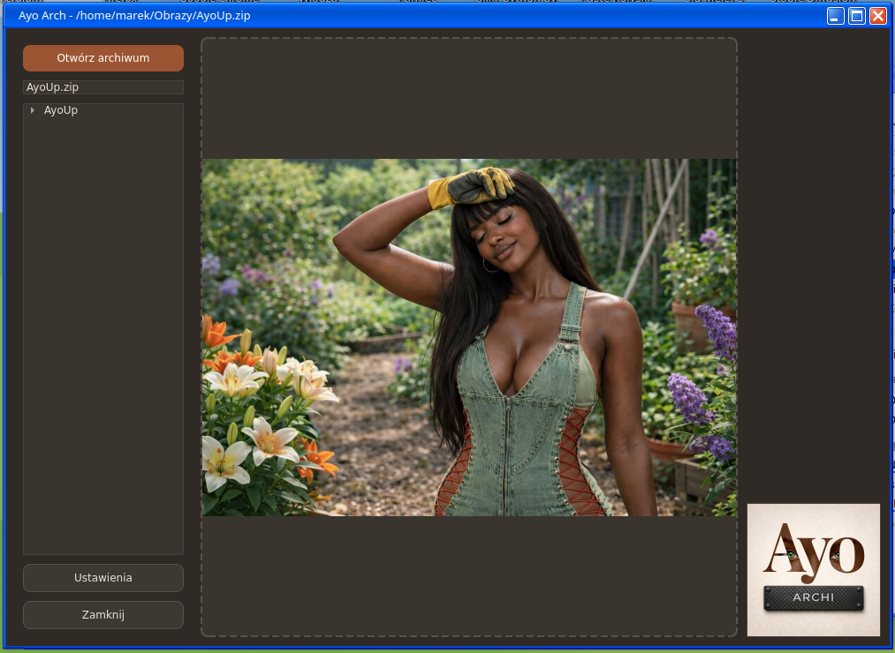
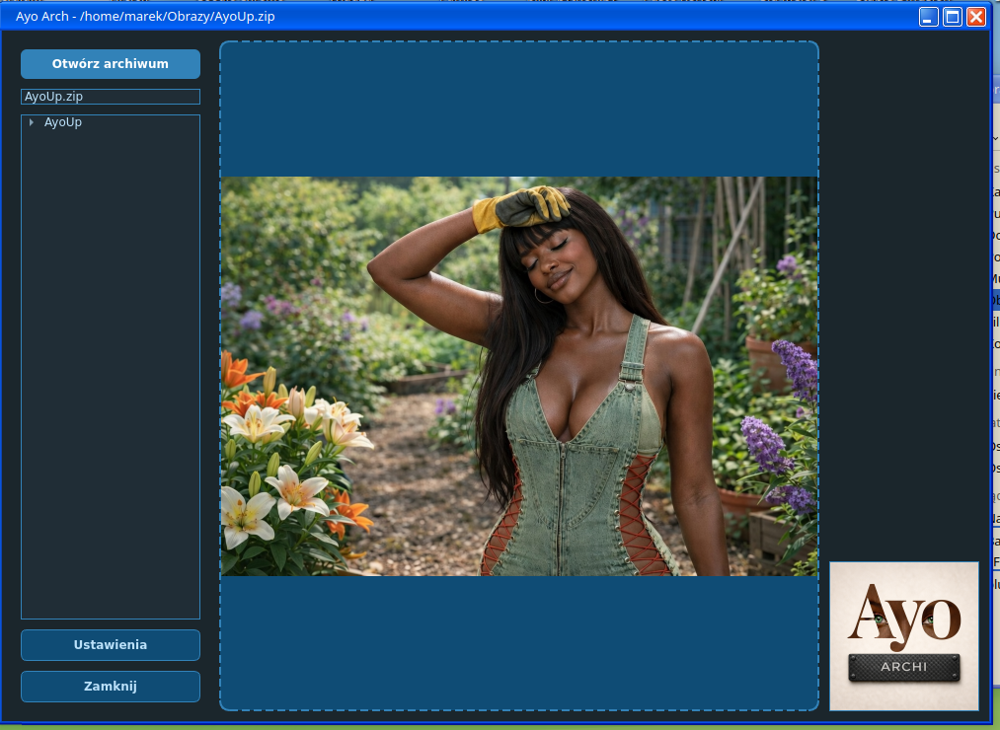
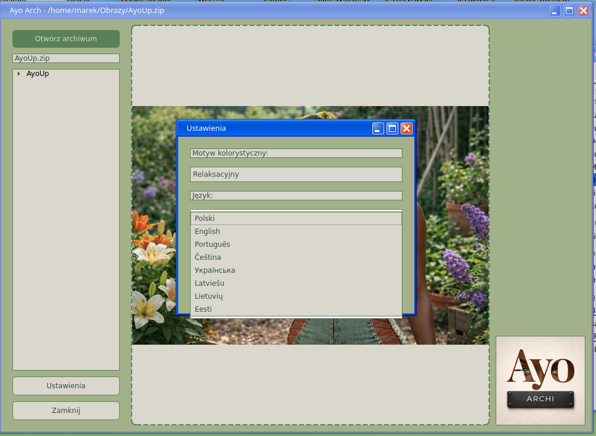
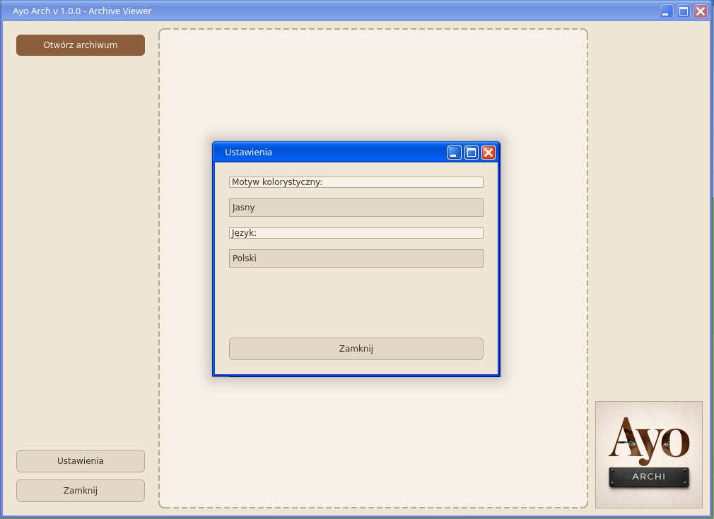

# AyoARCH 1.5.0 – Intelligent Archive Image Viewer 📦🖼️

AyoARCH is a fast and lightweight desktop application designed to browse images directly inside archive files — without extracting them to disk.

Built for creators, researchers, writers, and collectors who work with large visual libraries and want fast, clean, and organized access to images.

Part of the Ayo Ecosystem.

## 📸 Screenshots

### Main Interface Themes

| Dark | Light | Creative | Relax | System |
|---|---|---|---|---|
| [](screenshots/main_dark.png) | *(screenshot not available yet)* | [](screenshots/main_creative.png) | [](screenshots/main_relax.png) | *(screenshot not available yet)* |

### Functional Views

| Theme Selection | Language Selection |
|---|---|
| [](screenshots/settings.png) | [](screenshots/settings.png) |

## 🆕 What’s New in 1.5.0

### 🌍 Modern Internationalization System

AyoARCH now uses a JSON-based translation system.

#### ✔ Migration to JSON

All language files moved from Python modules to:

`i18n/<language>.json`

Advantages:

- easier language management
- simpler translation updates
- cleaner project architecture

### 🌐 Expanded Language Support

AyoARCH now supports 24 languages:

| | | |
|---|---|---|
| 🇵🇱 Polish | 🇺🇸 English | 🇪🇸 Spanish |
| 🇫🇷 French | 🇩🇪 German | 🇳🇱 Dutch |
| 🇩🇰 Danish | 🇸🇪 Swedish | 🇳🇴 Norwegian |
| 🇫🇮 Finnish | 🇮🇸 Icelandic | 🇭🇺 Hungarian |
| 🇷🇴 Romanian | 🇧🇬 Bulgarian | 🇮🇹 Italian |
| 🇵🇹 Portuguese | 🇺🇦 Ukrainian | 🇨🇿 Czech |
| 🇸🇰 Slovak | 🇱🇹 Lithuanian | 🇱🇻 Latvian |
| 🇪🇪 Estonian | 🇬🇷 Greek | 🇬🇪 Georgian |

### 📦 Archive Creation Support

AyoARCH now includes a ZIP archive creator.

Features:

- drag & drop file selection
- thumbnail preview system
- clean visual layout
- ZIP archive generation
- protection against empty archives

### 📂 Expanded Archive Format Support

Supported archive formats:

- ZIP
- 7Z
- CBZ
- RAR
- CBR

### Smart Dependency Manager

If optional libraries are missing (`py7zr`, `rarfile`), AyoARCH will automatically:

- detect the missing module
- ask the user for permission
- install it automatically

Ensuring a smooth experience without manual setup.

## 🚀 Key Features

### ⚡ Zero-Temp Strategy

Images are loaded directly into RAM.

AyoARCH never creates temporary files, which means:

- faster browsing
- clean filesystem
- SSD-friendly workflow

### 📦 Instant Archive Browsing

Open and browse images directly inside archives without extraction.

Supported archive types:

- ZIP
- 7Z
- CBZ
- RAR
- CBR

### 🧠 Smart Archive Navigation

Sidebar archive explorer:

- browse folder structure inside archives
- fast navigation
- optimized for large archives

### 🖼️ Modern Drag & Drop Workflow

Supports:

- drag & drop archive opening
- drag & drop files into archive creator
- multi-file workflows

### 🎨 Themes

AyoARCH features a modern theme system.

Available themes:

- Dark Theme
- Light Theme
- Creative Theme
- Relax Theme
- System Theme

Features:

- dynamic theme switching
- consistent UI styling
- non-native Qt dialogs for full theme control

## 🖼️ Supported Image Formats

### Standard formats

- PNG
- JPG / JPEG
- BMP
- GIF

### Modern formats

- TIFF / TIF
- WEBP

### System icons

- ICO

## 🏗️ Architecture

AyoARCH uses a modular Python + Qt structure.

- `main.py`
- `ui.py`
- `settings.py`
- `themes/`
- `i18n/`
- `assets/`

Core components:

- modular GUI architecture
- theme styling system
- JSON-based translation layer
- archive management layer
- smart dependency manager

## 🛠 Technology

Developed with modern Python and Qt tools.

- Python 3.10+
- PySide6 (Qt for Python)
- zipfile (Python standard library)
- py7zr (optional)
- rarfile (optional)

Development environment:

- openSUSE
- Fedora

## 🌌 Ayo Ecosystem

AyoARCH is part of a growing set of creative tools.

- AyoUP – intelligent image upscaler
- AyoCONVERT – file conversion tool
- AyoSORT – intelligent image categorization

More projects:

👉 https://klucznik26.github.io/AyoWWW/

## 📖 About the Project

AyoARCH was created as part of a creative toolkit supporting:

- visual research
- world-building
- image reference libraries
- archive-based image collections

The goal is simple:

Browse large collections of images stored inside archives instantly — without unpacking them.

## 📥 Installation

### Clone repository

```bash
git clone https://github.com/Klucznik26/AyoARCH.git
cd AyoARCH
```

### Install dependencies

```bash
pip install -r requirements.txt
```

### Run application

```bash
python main.py
```

## 🗺 Roadmap

Planned future improvements:

- AppImage distribution for Linux
- performance optimization for very large archives
- improved thumbnail caching
- additional archive creation options
- extended image metadata support

## 🤝 Contributing

Contributions, feedback, and suggestions are welcome.

Feel free to open issues or submit pull requests.

## 📄 License

This project is released under the MIT License.
